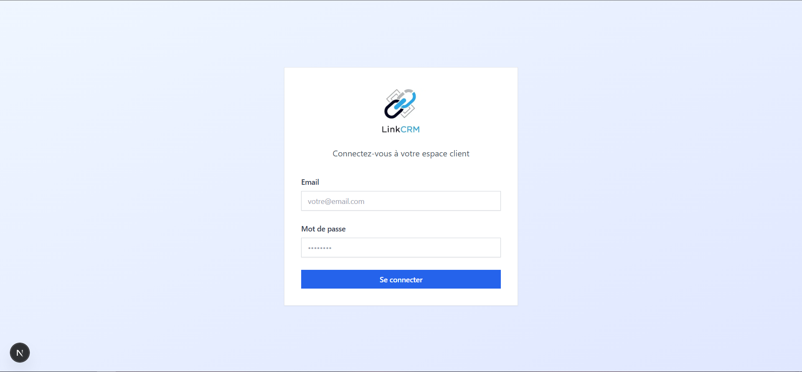
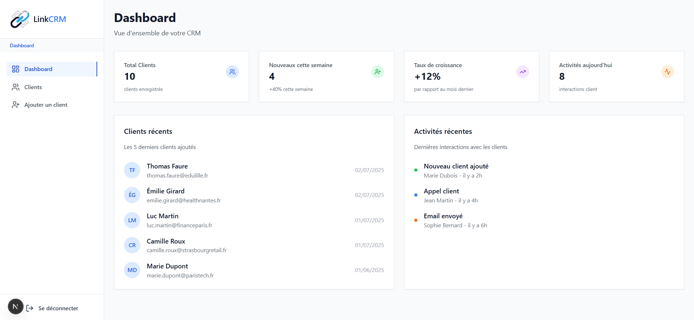
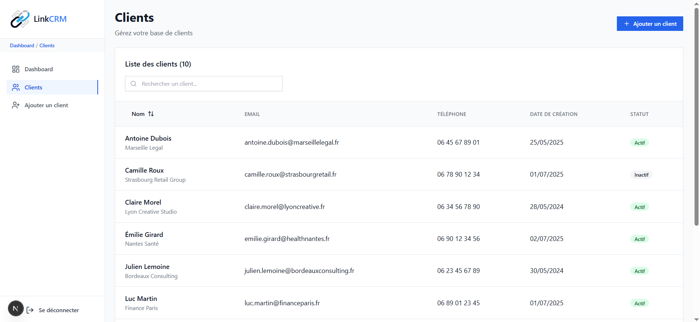
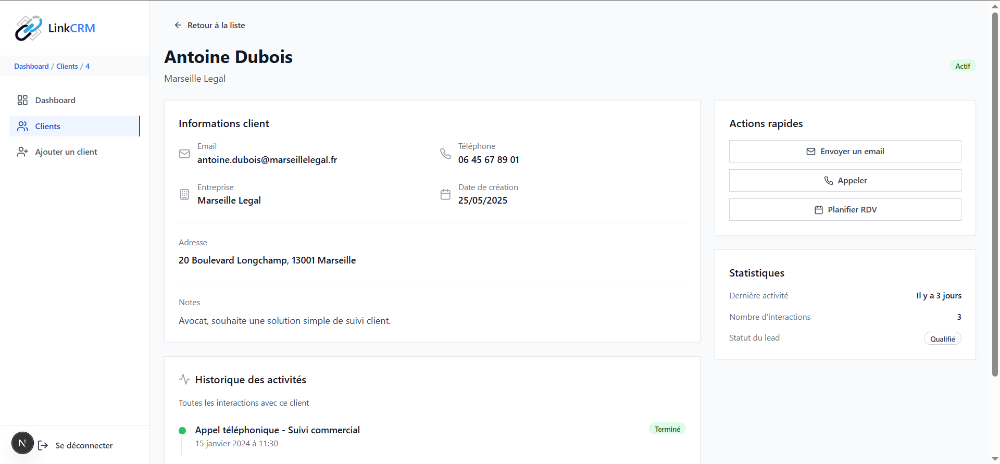
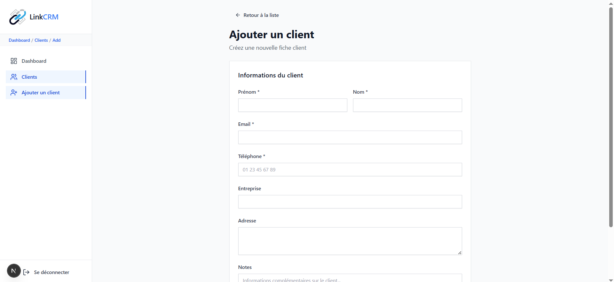

# LinkCRM - Application de Gestion Client

LinkCRM est une application CRM moderne, pensée pour aider une équipe commerciale à gérer facilement ses clients. Construite avec Next.js, TypeScript et Tailwind CSS, elle propose une interface intuitive et responsive, avec toutes les fonctionnalités essentielles pour suivre ses contacts au quotidien.
## Structure du projet

```
├── app/
│   ├── login/
│   │   └── page.tsx              # Page de connexion (mock)
│   ├── dashboard/
│   │   ├── layout.tsx            # Layout avec sidebar
│   │   ├── page.tsx              # Dashboard principal
│   │   └── clients/
│   │       ├── page.tsx          # Liste des clients
│   │       ├── add/page.tsx      # Formulaire d'ajout
│   │       └── [id]/page.tsx     # Fiche client détaillée
├── components/
│   ├── Navbar.tsx                # Navigation principale
│   ├── ClientTable.tsx           # Table des clients avec recherche/tri
│   ├── ClientForm.tsx            # Formulaire d'ajout client
│   ├── ClientCard.tsx            # Fiche détaillée client
│   └── Layout.tsx                # Layout wrapper
├── data/
│   └── mock.ts                   # Données mockées (10 clients)
├── styles/
│   └── globals.css               # Styles globaux + variables CSS
├── types/
│   └── client.ts                 # Types TypeScript
├── utils/
│   └── validation.ts             # Fonctions de validation
└── README.md
```

## Fonctionnalités

### Fonctionnalités principales

1. **Page de connexion (Mock)**
   - Interface responsive sans validation backend
   - Redirection automatique vers le dashboard

2. **Dashboard**
   - Vue d'ensemble avec statistiques
   - Cartes de métriques (total clients, nouveaux, croissance)
   - Liste des clients récents
   - Historique des activités

3. **Liste des clients**
   - Table responsive avec 10 clients mockés
   - **Recherche en temps réel** (nom, email, téléphone)
   - **Tri par nom** (ascendant/descendant)
   - Colonnes : nom, email, téléphone, date de création, statut
   - Navigation vers les fiches détaillées

4. **Fiche client détaillée**
   - Informations complètes du client
   - Historique des activités avec timeline
   - Actions rapides (email, appel, RDV)
   - Statistiques du client

5. **Formulaire d'ajout**
   - **React Hook Form** avec validation
   - **Champs obligatoires** : prénom, nom, email, téléphone
   - **Validation email et téléphone français**
   - Messages d'erreur en temps réel
   - Message de succès avec redirection

## Aperçu visuel
**Page de connexion :**

**Dashboard principal :**

**Liste des clients :**

**Détails d’un client :**

**Ajouter un client :**

### Identité visuelle & UI personnalisée

- Logo professionnel intégré dans l'interface
- Composants UI créés from scratch : bouton, input, badge, carte, etc.
- Palette de couleurs cohérente grâce aux variables CSS
- Icônes Lucide React pour une expérience moderne
- Responsive design pensé mobile-first

## Stack technique

- **Framework** : Next.js 14 (App Router)
- **Language** : TypeScript
- **Styling** : Tailwind CSS
- **Formulaires** : React Hook Form
- **Icons** : Lucide React
- **Données** : Mock data statique

## Installation et lancement

1. **Cloner le repository**
```bash
git clone https://github.com/badie16/LinkCRM.git
cd LinkCRM
```

2. **Installer les dépendances**
```bash
npm install
```

3. **Lancer en développement**
```bash
npm run dev
```

4. **Ouvrir l'application**
Rendez-vous sur [http://localhost:3000](http://localhost:3000)

## Utilisation

### Connexion
- Page de connexion accessible à la racine
- Saisissez n'importe quel email/mot de passe (mock)
- Redirection automatique vers le dashboard

### Navigation
- **Sidebar responsive** avec menu hamburger sur mobile
- **Dashboard** : Vue d'ensemble avec statistiques
- **Clients** : Liste complète avec recherche et tri
- **Ajouter un client** : Formulaire de création

### Gestion des clients
- **Recherche** : Filtrage en temps réel par nom, email ou téléphone
- **Tri** : Clic sur "Nom" pour trier par ordre alphabétique
- **Détails** : Clic sur une ligne pour voir la fiche complète
- **Ajout** : Formulaire avec validation des champs obligatoires

## Données et validation

### data/mock.ts
- 10 clients français mockés
- Données réalistes (noms, entreprises, adresses)
- Statuts actif/inactif
- Dates de création variées

### utils/validation.ts
- Validation email (regex)
- Validation téléphone français
- Formatage des dates
- Utilitaires de formatage

### types/client.ts
- Interface Client complète
- Type ClientFormData pour les formulaires
- Interface Activity pour l'historique

##  Points forts de l'implémentation

1. **Logo professionnel** intégré dans toute l'interface
2. **Composants UI authentiques** créés from scratch
3. **Architecture claire** selon les meilleures pratiques
4. **Code TypeScript** propre et bien typé
5. **Validation robuste** avec messages d'erreur français
6. **Interface responsive** parfaite sur tous écrans
7. **Données réalistes** pour une démonstration convaincante
8. **Navigation intuitive** avec états actifs
9. **Performance optimisée** avec Next.js App Router
10. **CSS personnalisé** avec variables et animations
11. **Développement authentique** sans dépendances UI externes
12. **Icônes cohérentes** avec Lucide React

## Améliorations possibles

- Tests unitaires (Jest, Testing Library)
- Base de données réelle (Supabase, Prisma)
- Authentification (NextAuth.js)
- Pagination pour la liste
- Système de tags
- Export des données
- Mode sombre
- Notifications temps réel

## Remerciements

Ce projet a été réalisé dans le cadre d’un test technique pour démontrer mes compétences en développement front-end avec Next.js, TypeScript et Tailwind CSS. J’ai voulu proposer une application complète, claire et agréable à utiliser, en évitant les dépendances UI externes pour garder un contrôle total sur l’expérience utilisateur.

Merci pour votre intérêt !

– Badie Bahida